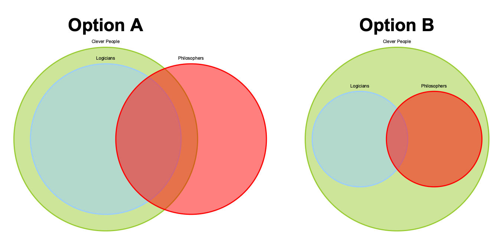

[TOC]

# An Introduction to Formal Logic, Second Edition

[Book Link](https://www.amazon.com/gp/product/B08GB4BDPG/ref=ppx_yo_dt_b_asin_title_o00_s00?ie=UTF8&psc=1)

## End of Chapter Exercises

### Chapter 1

"What are the premises, inference markers, and conclusions of the following
arguments? Which of these arguments [are deductively valid]?"

1. Most politicians are corrupt. After all, most ordinary people are corrupt -
   and politicians are ordinary people.
	* Premisses:
		* Politicians are ordinary people.
		* Most ordinary people are corrupt.
	* Inference markers: After all
	* Conclusion: Most politicians are corrupt.
	* **Not deductively valid**: Most ordinary people are corrupt implies that
	there are some ordinary people who are not corrupt. It is a possibility
	that the population of non-corrupt ordinary people is the population that
	all politicians come from. In this case, no politicians would be corrupt.

2. Anyone who is well prepared for the exam, even if she doesn't get an A grade,
   will at least get a B. Jane is well prepared, so she will at least get a B
   grade.
	* Premisses:
		* Anyone who is well prepared for the exam will at least get a B.
		* Jane is well prepared for the exam.
	* Inference markers: so
	* Conclusion: She (Jane) will at least get a B.
	* **Deductively valid**: 'Anyone' is similar to 'all' - so this argument
	  follows the below schema:.

$$
\text{ All F are G } \\
n\text{ is F } \\
\text{Therefore } n \text{ is G } \\
$$

3. John is taller than Marcy and Jane is shorter than Marcy. So John is taller
   than Jane.
	* Premisses:
		* John is taller than Marcy.
		* Janes is shorter than Marcy.
	* Inference markers: so
	* Conclusion: John is taller than Jane.
	* **Deductively valid**: (not sure what schema this follows, but I
	  suspect is is a close relative of the "All *F* are *G* - *n* is *F* -
	  so *n* is *G*" schema)

4. At eleven, Fred is always either in the library or in the coffee bar. And
   assuming he's in the coffee bar, he's drinking an espresso. Fred was not in
   the library at eleven so he was drinking an espresso then.
	* Premisses:
		* At eleven, Fred is always either in the library or in the
		  coffee bar. 
		* If Fred is in the coffee bar, he's drinking an espresso.
		* Fred was not in the library at eleven.
	* Inference markers: so
	* Conclusion: he [Fred] was drinking an espresso.
	* **Deductively valid**: (not sure what schema this follows, but I
	  suspect is is a close relative of the "All *F* are *G* - *n* is *F* -
	  so *n* is *G*" schema, however with one more inferencial step,
	  something like the following:)

$$
\text{Either F or G} \\
\text{If G then H} \\
\text{Not F} \\
\text{So G} \\
\text{Therefore H} \\
$$
	
5. The Democrats will win the election. There's only a week to go. The poll's
   put them 20 points ahead, and a lead of 20 points with only a week to go to
   polling day can't be overturned.
	* Premisses:
		* There is only a week to go [to polling day].
		* [The Democrats] are 20 points ahead.
		* A lead of 20 points with only a week to go to polling day
		  can't be overturned.
	* Inference markers: so (implicit?)
	* Conclusion: The Democrats will win the election.
	* **Deductively valid** 
		* [From answers online] - Not valid inference. The Democrats can
		  stiall have a lead both in polling and popular vote on the day
		  and yet lose ... To get a valid inference, we'd have to add a
		  missing premise ruling out that possibility.
		* The premise you could add might be - "Whichever party is ahead
		  in the polls on election day wins the election."
	
6. Dogs have four legs. Fido is a dog. Therefore Fido has four legs.
	* (too simple to be worth writing out)
	* [From answers online] - Should have paid attention; there is no "All"
	in the argument. "All dogs have four legs. Fido is a dog. Therefore
	Fido has four legs." is a valid inference. However, some dogs might
	not have four legs (accident, birth defect, etc.), so there is some
	possibility that Fido is one of these less fortunate dogs and does not
	have four legs.
$$
\text{ All F are G } \\
n\text{ is F } \\
\text{Therefore } n \text{ is G } \\
$$
  
7.  Jekyll isn't the same person as Hyde. The reason is that no murderers are
    sane - but Hyde is a murderer, and Jekyll is certainly sane.
	* Premisses:
		* No murderers are sane.
		* Hyde is a murderer.
		* Jekyll is sane.
	* Inference markers: so
	* Conclusion: Jekyll isn't the same person as Hyde.
	* **Deductively valid** 

8. All the slithy toves did gyre and gimble in the wabe. Some mome raths are
   slithy toves. Hence some mome raths did gyre and gimble in the wabe.
	* Premisses:
		* All slithy toves did gyre and gimble [in the wabe].
		* Some mome raths are slithy toves.
	* Inference markers: All, hence.
	* Conclusion: Some mome raths did gyre and gimble [in the wabe].
	* **Deductively valid** 

9. Some but not all philosophers are logicians. All logicians are clever. Hence
   some but not all philosophers are clever.
	* Premisses:
		* All logicians are clever.
		* Some philosophers are logicians.
	* Inference markers: "Some but not all"
	* Conclusion: Some but not all philosophers are clever.
	* **Not Deductively Valid**: The "but not all" in the conlusion
	  statement makes this argument not cogent. It could be the case that
	  some philosophers are logicians, all logicians are clever, *and all
	  philosophers are clever* (option B). Option A would fit the
	  both the premises and the conclusion, however, the fact that option B
	  is coherent with the premises given, means that the argument is not
	  deductively valid.

10. No experienced person is incompetent. Jenkins is always blundering. No
    competent person is always blundering. Therefore Jenkins is inexperienced.
	* Premisses:
		* No experience person is incompetent.
		* No competent person is always blundering.
	* Inference markers: Therefore.
	* Conclusion: [ Jenkins is always blundering, ] therefore Jenkins is
	  inexperienced.
	* **Not Deductively Valid**: "Jenkins is always blundering. No competent
	  person is always blundering. Therefore jenkins is not competent
	  (incompetent)," would be cogent. I'm not sure that jenkins being incompetent **necessarily** implies that he
	  is inexperienced.

11. Many politicians take bribes. Most politicians have extra-marital affairs. So many people who take bribes have
    extra-marital affairs.
	* Premises:
		* Many politicians take bribes.
		* Most politicians have extra-marital affairs.
	* Inference markers: so
	* Conclusion: Many people who take bribes have extra-marital affairs.
	* **Not Deductively Valid**: This somewhat depends on the definition of many...however, that dependence seems to
	  imply to me that is isn't deductively valid. It could be that the politicians who take bribes are a minor
	  subset (call it 10%) of the population of people that take bribes. If that is the case, then the premises do
	  not entail the conclusion.

	  The linguistic "move" that is being made here is what I'll call "implied intersectionality" for the time
	  being. The first two premises make the reader think that there is an intersection of politicians who both take
	  bribes and have extra-marital affairs. Regardless of the fact that *this* isn't necessarily true, politicians
	  are a small subset of people. Therefore, it could be the case that there is no intersection of people who take
	  bribes and have extra-marital affairs (shown below).

12. Kermit is green all over. Hence Kermit is not red all over.
	* Premises:
		* Kermit is green all over.
	* Inference markers: Hence.
	* Conclusion: Kermit is not red all over.
	* **Deductively Valid**: Unless there is some way to be both green and red all over...(could be a trick
	  question).

13. Every letter is in a pigeonhole. There are more letters than there are pigeonholes. So, some pigeonhole contains
    more than one letter.
	* Premises:
		* Every letter is in a pigeonhole.
		* There are more letters than there are pigeonholes.
	* Inference markers: So
	* Conclusion: Some pigeonhole contains more than one letter.
	* **Deductively Valid**: Important to note the precision of the conclusion; the statement, "some pigeonhole**s**
	  contain more than one letter," would not be deductively valid because it could be the case that there are
	  $N-1$ pigeonholes with one letter in them, and the $N^{th}$ pigeonhole has all the overflow. If that were the
	  case, then the plurality of "pigeonholes" would invalidate the statement. As it is written, however, it is
	  deductively valid.

14. There are more people than there are hairs on anyone's head. So at least two people have the same number of hairs on
    their head.
	* Premises:
		* There are more people than there are hairs on anyone's head.
	* Inference markers: So
	* Conclusion: So at least two people have the same number of hairs on their head.
	* **Deductively Valid**: math proof??

$$
\begin{align}

|P| & \le |H| \\

\end{align}
$$

## Unorganized Thoughts

* (page 1): "This kind of extrapolation from the past to the future, or more
  generally from some sample of cases to further cases, is standardly called
  *inductive*. The inference...might be inductively strong - meaning that the
  conclusion is highly probable, assuming the premises are true - but the
  inference is not deductively valid."
  * Ties in with a quote from [Deep Learning](https://www.deeplearningbook.org),
    section 5.2.1 - "Inductive reasoning, or inferring general rules from a
    limited set of examples is not logically valid".
    * This means that statistical inference/probability is not deductively valid.

* (page 7): Asking whether the premises are true, whether the axioms are
  axiomatic, is not in the domain of deductive logic. Deductive logic is
  concerned with valid inferential steps from premises to conclusions.

## Reasoning Checks

## Page 2

* ( 1 ) All republican voters support capital punishment.
* ( 2 ) Jo supports capital punishment.
* So ( 3 ) Jo is a republican voter

This is not deductively valid since Jo could be someone who supports capital
punishment but is not a republican. That is, the blue and red circles below are
an illustration of the first premise ( 1 ). Premise ( 2 ) is shown in green;
both **Jo 1** and **Jo 2** support capital punishment, however **Jo 1** isn't a
republican voter.

* ( 1 ) Most Irish people are Catholics.
* ( 2 ) Most Catholics oppose abortion on demand.
* So ( 3 ) At least some Irish people oppose abortion on demand.

( 2 ) Implies there are at least some Catholics who don't oppose abortion on
demand. It is a possibility that these Catholics are the entire set of Irish
Catholics, in which case the conclusion ( 3 ) would be false and therefore the
sequence is not deductively valid.
