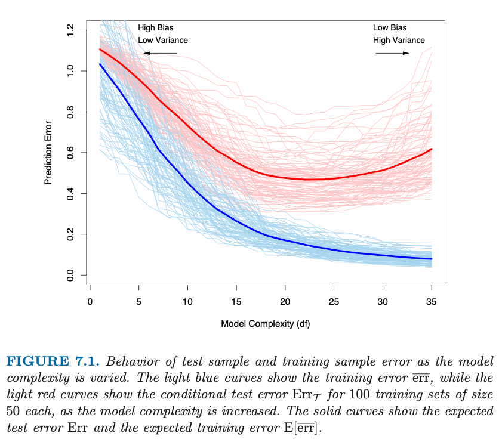

# Book Title 

[TOC]

## Unorganized Thoughts

* What happened that led me to write this?
    * At work (MLX), I used 10-Fold CV to estimate the test error of three different algorithms. *Note that I did not
      use CV to* **choose** *better hyperparameters for each algorithm.* For all three algorithms, it seems as though
      the CV estimate of the test error was dramatically optimistic when compared to the test error of the 'final' test
      data set.

      What does this mean, statistically?

## Chapter Insights

### Chapter 7: Model Assessment and Selection

* Your predictive model, $\hat{f}(X)$, is created using the training set, $\tau$, and is should therefore be
  identified/indexed by this fact.

$$
\text{Predictive model built with training set } \tau = \hat{f}(X)_{\tau}
$$

* The loss function (abstractly - not tied to a continuous ) $L(Y, \hat{f}(X)_{\tau})$

$$
\text{Err}_{\tau} = E[L(Y, \hat{f}(X)_{\tau})]
\text{Err}_{\tau} = E[L(Y, \hat{f}(X))|\tau]
$$

## Reasoning Checks
